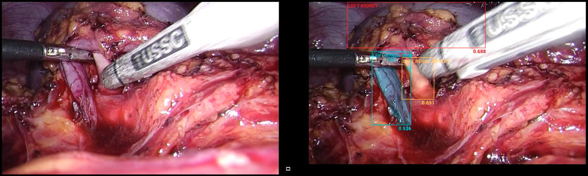

# Smart Surgery Technology - Minimally Invasive Surgery AI Recognition System (MISARS)

Artificial Intelligence to identify Surgical Anatomy for Intraoperative Guidance during Laparoscopic Donor Nephrectomy, running on Advantech edge AI devices with hardware acceleration.

## Overview

This repository demonstrates the pilot use of a patented proprietary deep learning (DL)-based computer vision (CV) to automatically recognise and highlight key anatomical structures to prevent intraoperative injuries, which is especially crucial during the learning curve.  

# Materials and Methods
7027 images manually annotated by pixels were selected from 16 surgical videos University Hospital in Singapore for training as ground truth, and 2266 annotated images from 4 separate surgical videos were used for validation. This ensured a balanced validation ratio of nearly 20% for each label (spleen, left kidney, renal artery, renal vein, and ureter). 

# Hardware Requirement
This repository provides a streamlined solution for running SST Surgical AI Imaging applications container on Advantech edge AI hardware. The Container includes toolkit  which automatically detects your device capabilities and sets up an optimized environment for computer vision tasks with full hardware acceleration support.

Designed specifically for Advantech edge AI devices based on NVIDIA IGX platforms, this toolkit enables rapid deployment of object detection, instance segmentation, and classification applications with minimal configuration required.

## Features

- **Complete Docker Environment**: Pre-configured container with all necessary hardware acceleration settings
- **Optimized Model Management**: Tools for downloading and converting MISARS models to accelerated formats
- **Hardware Acceleration Support**: Full integration with NVIDIA CUDA, TensorRT, and GStreamer
- **X11 Display Support**: Seamless visualization of model outputs directly from the container
- **Multiple Vision Applications**: Ready-to-use applications for surgical tissue detection, segmentation, and classification

## Applications Included

### Object Detection
- Real-time object detection using MISARS
- Support for 80+ COCO dataset classes
- Configurable confidence thresholds and post-processing


### Instance Segmentation
- Pixel-level object segmentation for precise boundary detection
- Multi-class segmentation capabilities
- Visualization tools for segmentation masks

### Object Classification
- High-accuracy image classification
- Support for custom classification tasks
- Class confidence visualization

## Quick Start

1. Clone this repository:
```bash
git clone https://github.com/Advantech-EdgeSync-Containers/SmartSurgery-MISARS.git
cd SmartSurgery-MISARS
```

2. Start the container environment:
```bash
chmod +x build.sh
./build.sh
```

3. The Docker container will launch with all necessary hardware acceleration. You can access the applications as described in the Usage sections below.

## Utility Usage

### Model Loading Utility

The `model-load.py` utility helps download optimized models for your Advantech device:

```bash
python3 src/model-load.py 
```

Parameters:
- `task`: Choose from 'detection', 'segmentation', or 'classification' (default: detection)
- `size`: Model size, use 'n' for nano or 's' for small (default: based on device)
- `dir`: Directory to save models (default: current directory)

Examples:
```bash
# Download a MISARS model
python3 src/model-load.py
```

### Model Export Utility

The `model-export.py` utility converts models to optimized formats for edge deployment:

```bash
python3 src/model-export.py
```

Parameters:
- `task`: Choose from 'detection', 'segmentation', or 'classification'
- `size`: Model size ('n' or 's' recommended)
- `format`: Export format (onnx, engine, torchscript)
- `device`: Device for optimization (cpu or 0 for GPU)
- `half`: Enable half precision (FP16) for faster inference

Examples:
```bash
# Export model to ONNX format
python3 src/model-export.py 
```

## Application Usage

### MISARS Surgical AI Application

The main `misars.py` application offers a complete solution for running MISARS models:

```bash
python3 src/misars.py 
```
### Results:
 
 #### Surgical Tissue Detection

Parameters:
- `--input`: Path to video file, image, or camera device ID (0 for primary camera)
- `--model`: Path to model file or model name (e.g., 'misars.pt')
- `--task`: Task type ('detect', 'segment', 'classify')
- `--conf`: Confidence threshold (default: 0.25)
- `--show`: Display results in real-time window
- `--save`: Save results to output directory
- `--device`: Device to run inference (cpu or 0 for GPU)

Examples:
```bash
# Run object detection on a test video
python3 src/misars.py --input data/test.mp4 --task detect --model misars.pt --show

# Run instance segmentation on camera feed
python3 src/misars.py --input 0 --task segment --model misars.pt --conf 0.3 --show
```

### Step-by-Step Usage Guide

1. **Set Up Environment**:
   - Start the Docker container using `./build.sh`
   - This initializes all hardware acceleration settings and dependencies

2. **Download Models**:
   - Use `model-load.py` to download appropriate models
   - Choose model size based on your device capability ('n' or 's' recommended)

3. **Convert Models (Optional)**:
   - Use `model-export.py` to convert to optimized formats
   - TensorRT format (engine) provides the best performance on Advantech devices

4. **Run Applications**:
   - Use `misars.py` with appropriate parameters for your use case
   - Configure input source, model, and task type as needed
   - Enable visualization with `--show` parameter

5. **Analyze Results**:
   - View real-time results on screen or examine saved outputs
   - Output includes annotations, bounding boxes, segments, or classifications based on task

## Directory Structure

```
.
├── data/               # Sample test data (includes test.mp4)
├── src/                # Source code for applications
│   ├── model-export.py # Model export utility
│   ├── model-load.py   # Model download utility
│   └── misars.py       # Main MISARS application
├── docker-compose.yml  # Docker Compose configuration
├── build.sh            # Build script
├── LICENSE             # License information
└── README.md           # This file
```


## Limitations

The current version of the toolkit has the following limitations:

1. **Model Size Constraints**: Only supports 'n' and 's' model variants to maintain real-time performance on edge devices. Larger models may exceed memory or computational capabilities of some devices.

2. **Pre-trained Models Only**: Currently limited to pre-trained MISARS models. Custom model training requires external workflows.

3. **Resolution Limits**: Performance degrades with very high-resolution inputs (>1080p). For best results, use input 1280×720 resolution.

4. **Network Dependency**: Initial model downloading requires internet connectivity.

5. **X11 Display Requirements**: Visualization features require X11 forwarding to be properly configured.

6. **Fixed Detection Classes**: Models use pre-trained COCO classes and cannot be dynamically changed without retraining.

7. **Single Stream Processing**: Currently supports processing one input stream at a time.

## Future Work

The following enhancements are planned for future releases:

**Confounding Factors:** Intraoperative variability, such as excessive fat, blood clots, or tissue inflammation, can obscure the visibility of critical anatomical structures. These factors complicate the model's task of distinguishing between similar-looking tissues, leading to potential misclassifications. For example, inflamed or fatty tissues may resemble vital structures like the renal artery, increasing the risk of false positives or missed detections.

**Absence of Relative Positional Correlation:** The current model lacks a spatial reference priori, meaning it does not consider the known relative positions of anatomical structures. This limitation can hinder the model’s accuracy in complex cases where the position of organs shifts during surgery. For example, knowing the relative position of the spleen to the renal artery could improve detection accuracy. Without such a reference, the model relies solely on visual cues, which may not be sufficient in all cases.

**Future Research Opportunities:** Future research could focus on integrating multi-modal data, such as combining real-time surgical video with 3D models generated from CT scans. This approach would offer a more complete view of both surface and internal anatomy, enhancing accuracy and improving intraoperative guidance. Additionally, developing a spatial correlation framework to map the relative positions of organs could further refine real-time predictions, helping surgeons navigate complex anatomical environments. This would lead to more precise and adaptable AI tools, ultimately improving surgical outcomes and safety.

## Use Cases

This toolkit is ideal for:
- **Healthcare**: Medical image analysis, soft organ detection, tissue segementation, instrument tracking


## License

Copyright (c) 2025 Smart Surgery Technology Co.  All rights reserved.

This software is provided by Smart Surgery Technology Co. "as is" and any express or implied warranties, including, but not limited to, the implied warranties of merchantability and fitness for a particular purpose are disclaimed.

For complete license details, see the [LICENSE](https://github.com/SmartSurgery-MISARS/SmartSurgery-MISARS/blob/main/LICENSE) file.

## Acknowledgments

- **[NVIDIA](https://developer.nvidia.com/)**: For CUDA, TensorRT, and other acceleration libraries that enable optimal performance on Advantech edge AI devices.